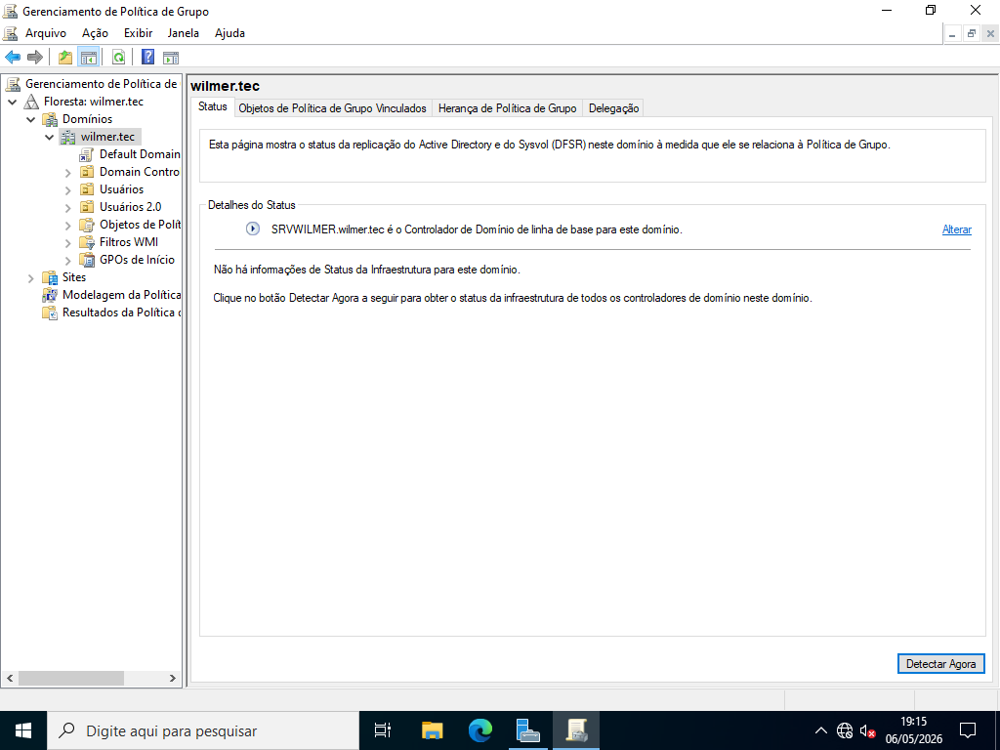
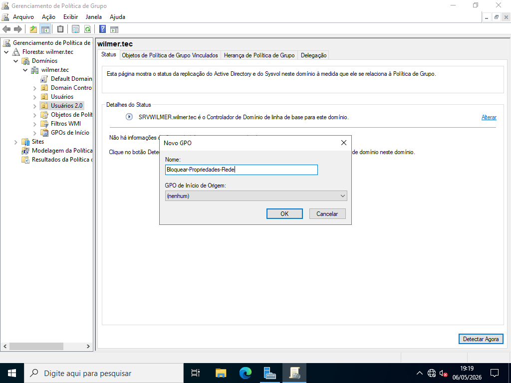
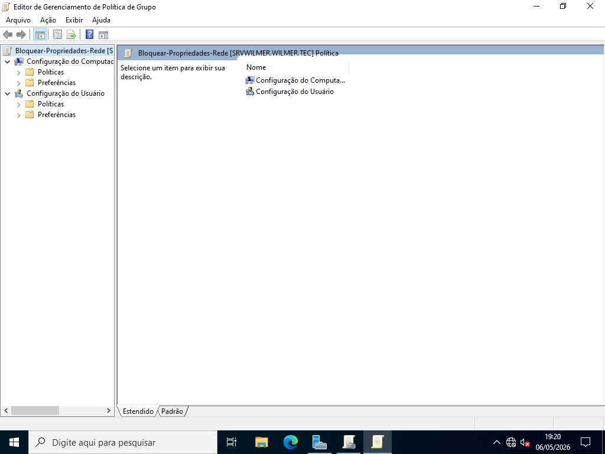
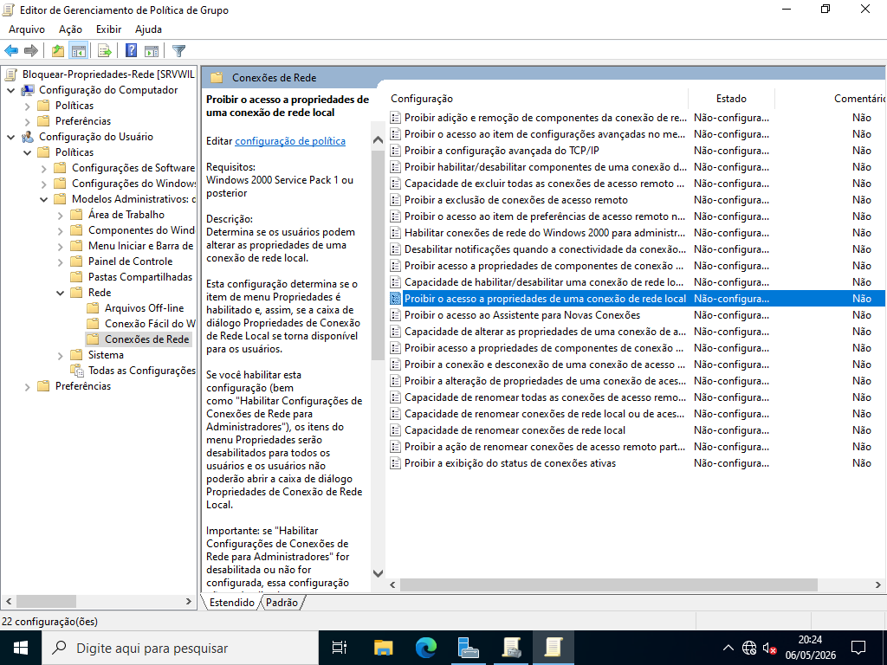
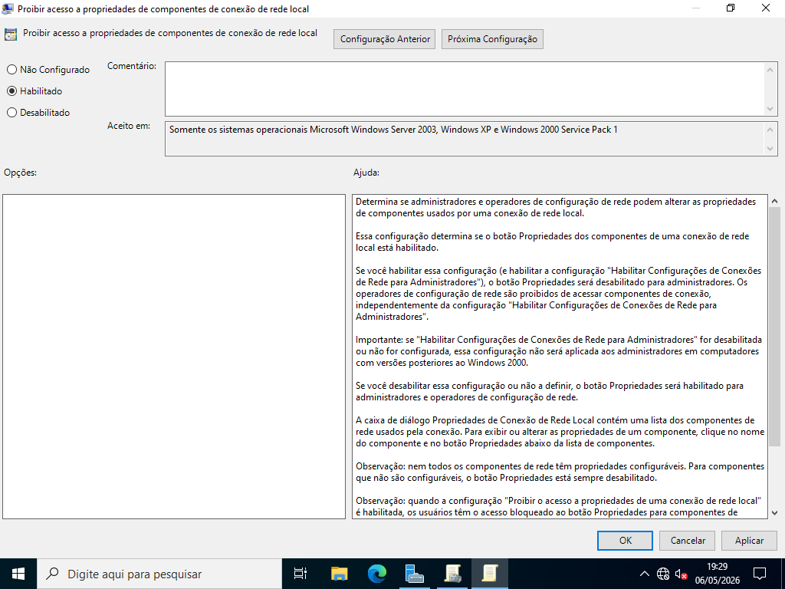
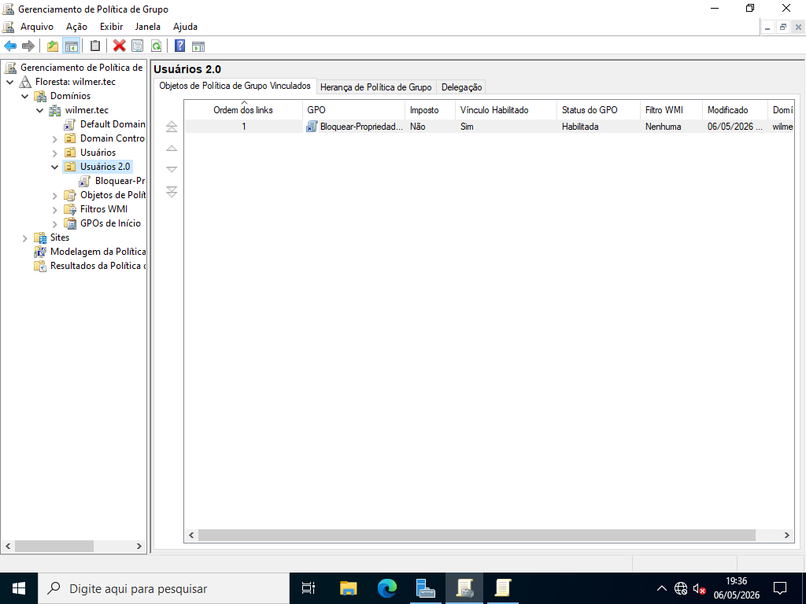

# Implementação da GPO

---

## Objetivo

Demonstrar o processo de criação e aplicação de uma GPO que impede usuários de alterar configurações de rede.

---

## 1. Acessando o Gerenciamento de Política de Grupo (GPMC)

Abra o **Gerenciamento de Política de Grupo** no servidor para iniciar a criação da política.

---

## 2. Criando a GPO

- Clique com o botão direito no domínio ou OU desejada  
- Selecione **"Crie um GPO neste domínio e vincule-o aqui..."**  
- Defina um nome para a GPO (ex: *Restrição de Rede*)

---

## 3. Editando a GPO

- Clique com o botão direito na GPO criada  
- Selecione **"Editar"** para abrir o editor de políticas  

---

## 4. Navegando até a política

No editor de políticas, siga o caminho:

Configuração do Usuário → Políticas → Modelos Administrativos → Rede → Conexões de Rede

---

## 5. Configurando a política

- Localize a política: **"Proibir acesso às propriedades de uma conexão de rede local"**  
- Abra a política  
- Marque a opção **Habilitado**  
- Clique em **Aplicar** e depois em **Ok**

---

## 6. Verificando a vinculação da GPO

Confirme se a GPO está vinculada corretamente ao domínio ou à OU desejada.

---

## 7. Testando a aplicação da política

- Acesse uma máquina cliente com um usuário comum  
- Tente abrir as propriedades de rede  

Resultado esperado:
- o acesso será bloqueado  
- o usuário não poderá alterar configurações  

---

## Resultado

Após a aplicação da GPO:
- usuários não conseguem modificar configurações de rede  
- reduz erros causados por alterações indevidas  
- mantém a rede estável e padronizada
