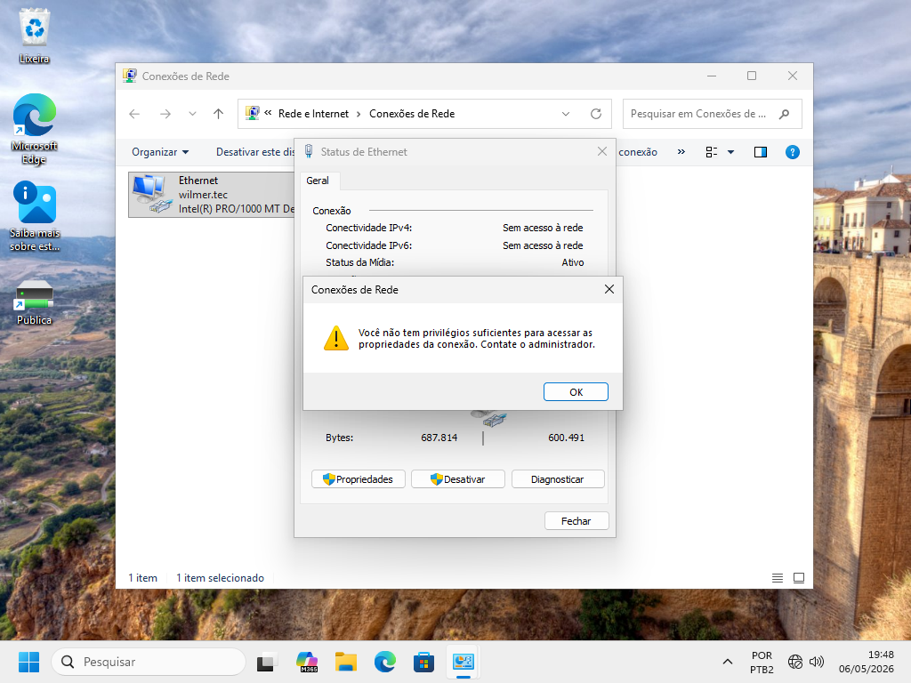

# GPO - Restrição de Configuração de Rede

**Unidade Curricular 7 - SENAC**

> **Data: 05 e 06 de maio de 2026**

**Professor:** Leandro Ramos

---

## Descrição

Esta atividade demonstra a criação e aplicação de uma GPO (Group Policy Object) para impedir que usuários alterem configurações de rede, como endereço IP, DNS e gateway.

---

## O que é GPO?

GPO (Group Policy Object) é um recurso do Windows Server que permite gerenciar configurações de usuários e computadores de forma centralizada dentro de um domínio.

Com GPOs, é possível:
- aplicar políticas de segurança  
- padronizar configurações  
- evitar alterações indevidas por usuários 

---

## Demonstração

---

## Conteúdo

O passo a passo detalhado com todas as configurações e imagens está disponível [aqui](Implementação/Passo-a-passo.md).

---

## Aplicação

Esse tipo de GPO é utilizado em ambientes corporativos para garantir maior controle sobre a rede e evitar problemas causados por configurações incorretas feitas por usuários.
